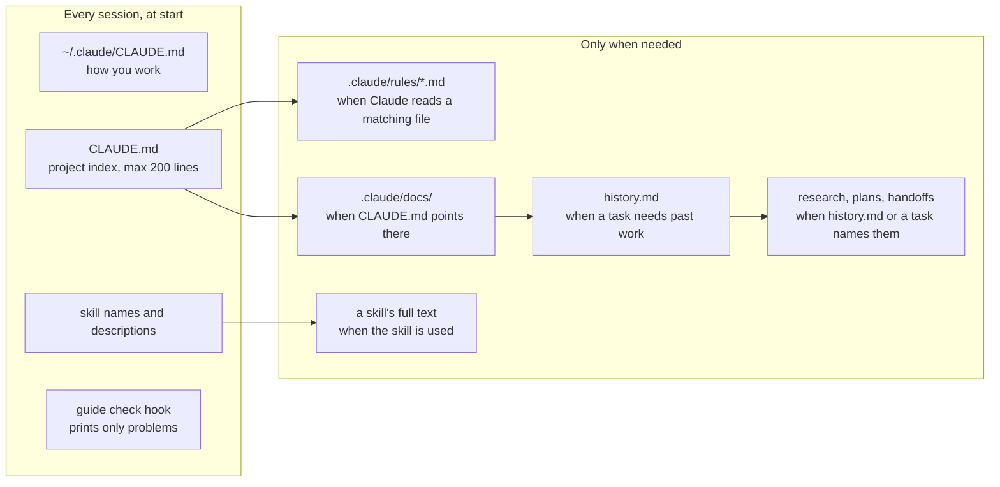
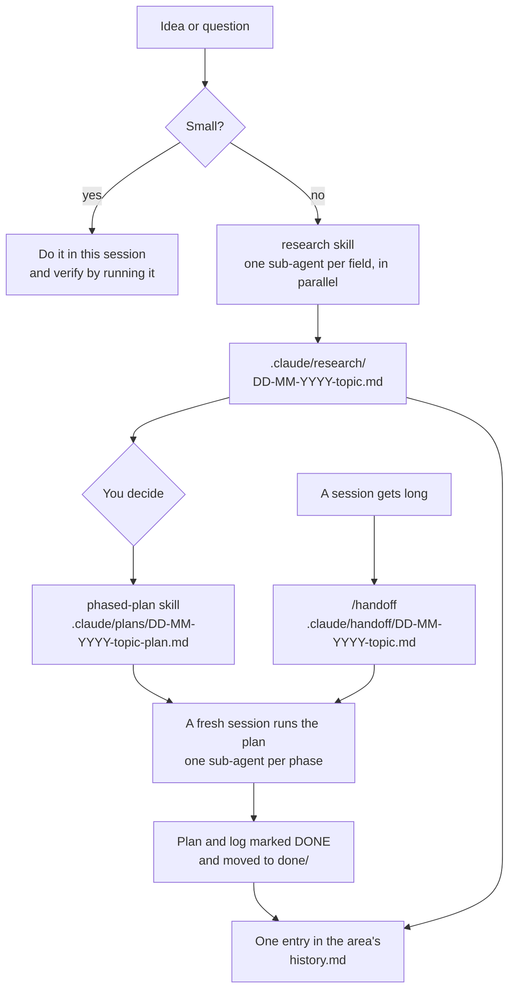
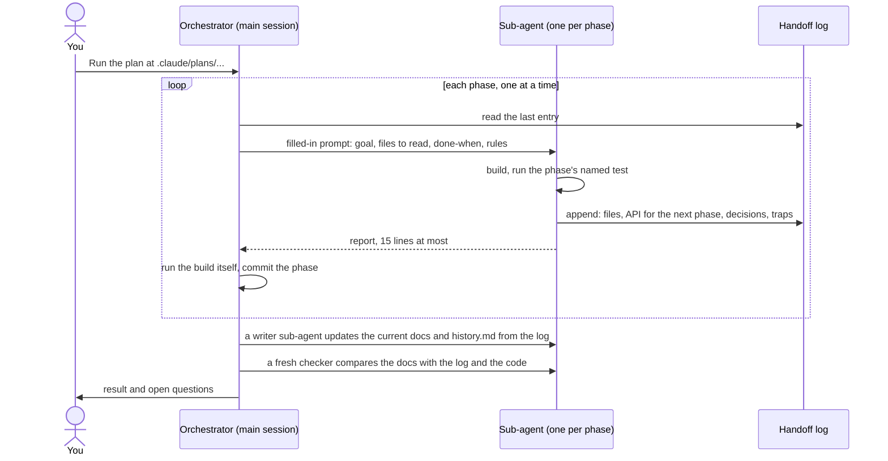
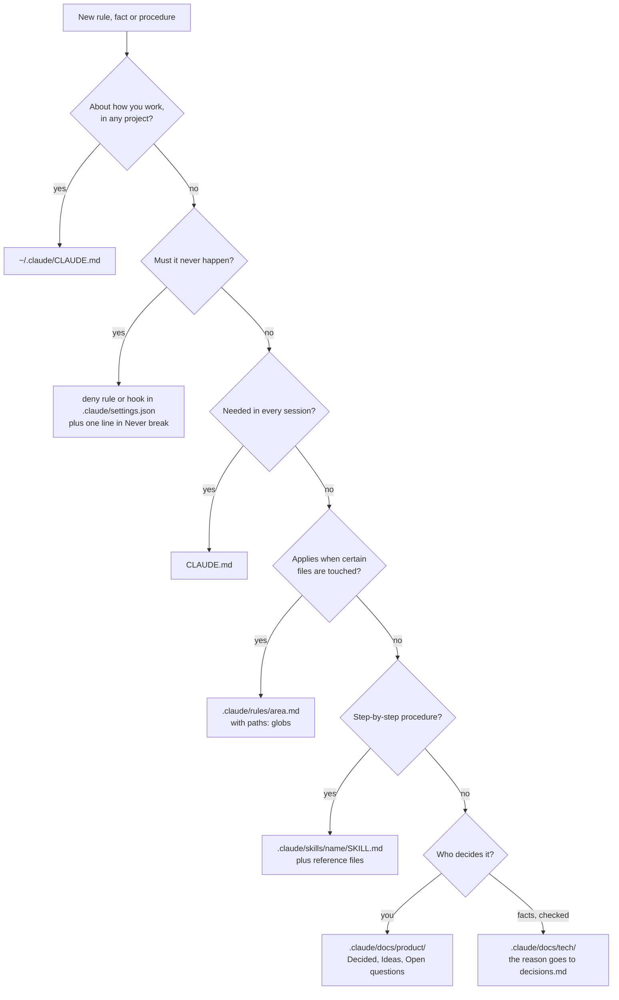
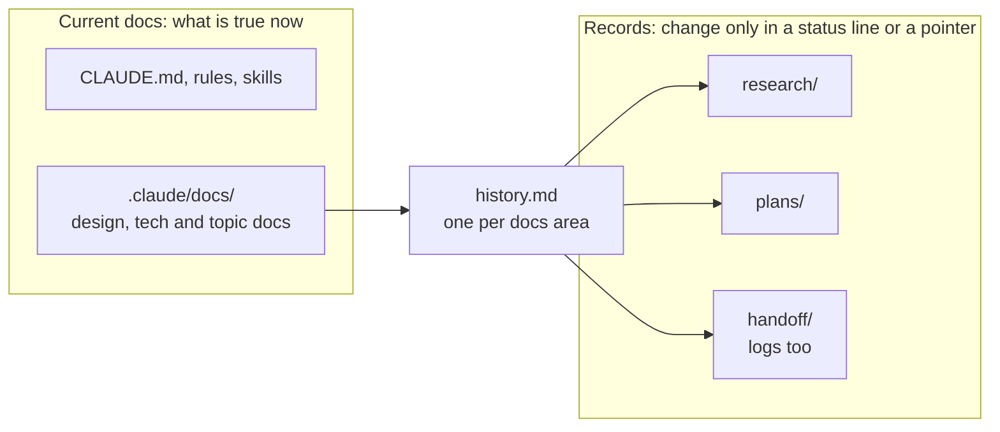
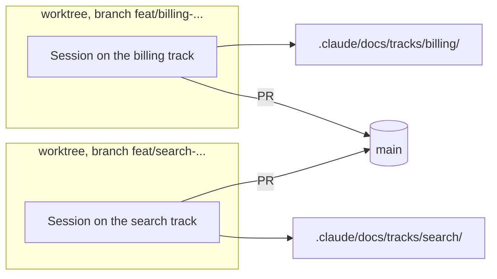

# claude-code-kit

A setup for working with [Claude Code](https://code.claude.com) as your main developer:

- **Global rules**: how Claude works with you in every project (writing, verifying, commits, plans).
- **Four skills**: `research` (parallel sub-agents write a sourced research doc), `phased-plan`
  (a plan that a fresh session runs phase by phase through sub-agents), `handoff` (hand a long
  session to a fresh one) and `docs-flow` (keep the docs current, decisions apart from history and
  the start context small, with a review mode on request).
- **A project skeleton**: a short agent guide (`CLAUDE.md`), one home for each kind of knowledge
  in `.claude/`, a `history.md` per docs area that indexes past work, a hook that tells Claude
  when the guide has gone stale, and a tool that finds facts lost when docs are trimmed.

It is not tied to a language, framework or tool, and works on macOS, Windows and Linux.

## Install

In your project, tell Claude Code:

> Read https://github.com/enmeshia/claude-code-kit and set it up globally and for this project,
> following its SETUP.md.

Claude clones the kit, runs the installer, merges it with the config you already have, asks you a
few questions about yourself and the project, fills the project guide from your code, and checks
the result. [SETUP.md](SETUP.md) is the procedure it follows.

By hand:

```bash
git clone https://github.com/enmeshia/claude-code-kit
cd claude-code-kit
sh install.sh all /path/to/project --dry-run   # see what it would do
sh install.sh all /path/to/project             # or: global, or: project /path/to/project
```

The installer never overwrites a file. It lists the files that already existed, so you can merge
them, and the `{{...}}` placeholders left to fill. Then ask Claude to "finish the setup with
SETUP.md, steps 4 to 8".

**Needs:** Claude Code and git. The installer, the hook and the tool are plain `sh` scripts, so
there is nothing else to install:

| | |
|---|---|
| macOS, Linux | `sh` is built in |
| Windows | `sh` comes with [Git for Windows](https://git-scm.com/downloads/win) (Git Bash). Claude Code then runs its commands and hooks in Git Bash. Run the commands above in Git Bash |
| Windows without Git for Windows | Claude copies the files itself and leaves the hook out. Everything works except the guide check and `lost_facts.sh` |

Tested so far on Windows. macOS testing is next.

## What's inside

```
global/                       installs to ~/.claude/
  CLAUDE.md                   how Claude works with you, in every project
  skills/research/            research split by field, one sub-agent per field
  skills/phased-plan/         plans that an orchestrator runs phase by phase
  skills/handoff/             /handoff: pass a long session to a fresh one
  skills/docs-flow/           keeps the project docs in shape; review mode on request
project/                      installs to your project root
  CLAUDE.template.md          the agent guide, installed as CLAUDE.md
  .claude/
    settings.json             the hook; your deny rules go here too
    hooks/check-guide.sh      the guide check, runs at session start
    tools/lost_facts.sh       finds facts lost when text leaves a current doc
    docs/product/             what the product is. You decide
    docs/tech/                how it is built, and why (decisions.md)
    docs/tracks/              optional: areas for parallel sessions
    docs/*/history.md         one per docs area: an index of past work
    rules/                    conventions that load with matching files
    skills/                   project procedures
    research/  plans/done/  handoff/done/
examples/rules/testing.md     what a path-scoped rule looks like
install.sh                    copies the kit, never overwrites
SETUP.md                      the install procedure, written for Claude
tests/                        tests for the installer and the hook
```

## How it works

### What loads when

Claude reads less than you think, and every line it reads at start costs attention in every
session. So only a small index loads up front, and everything else loads when it's needed.



`permissions.deny` rules in `.claude/settings.json` sit outside this picture: Claude Code enforces
them on every tool call, whatever the model remembers.

### The work loop



- **Research is not a plan, and not an order.** A research doc holds facts, options and a
  recommendation with sources. You decide, then a plan is written in a separate file.
- **Plans run in a fresh session.** The session that wrote a plan is full of discussion. A fresh
  one starts clean and reads only the plan.
- **Finished work moves to `done/`** with a status line on top, so open work is what's left in
  `plans/` and `handoff/`. Its area's `history.md` gets one entry that points to it.

### Running a phased plan

The main session is the orchestrator. It never reads source code, so its context stays small
enough to get through a dozen phases.



- **Phase 0 measures, it doesn't build.** It replaces the plan's guesses with real numbers before
  anything rests on them.
- **Every phase has a test that can disagree with it.** "Done when" is a command with numbers in
  it, not "it works".
- **The handoff log is the only memory between phases.** Each phase appends a fixed-shape entry.
- **A test that fails twice for the same reason stops the run.** No quiet redesigns at hour three.
- **Your answers are kept word for word** in the log, under
  `## Gate <name>, owner's answer (<date>)`.
- **Docs get checked like code.** A sub-agent writes them from the log, and a fresh one checks
  every number and path against the sources. It also looks for a test's pick, a proposal or a
  tool's limit written as the product's.

### Where knowledge goes

Each kind of knowledge has one home, so it's written once and found again.



Product docs keep **Decided**, **Ideas** and **Open questions** apart, and only you move
something into Decided. Your answers to open questions are recorded as leanings until you call a
point decided. A session that reads an idea as a spec builds the wrong thing.

Docs follow the change: when a change makes a doc, rule or skill wrong, the same change fixes it.

### Current docs and records



- **Current docs** (`CLAUDE.md`, rules, skills, and `.claude/docs/` except each `history.md`) say
  what is true now. A run's numbers, a dated story and your exact words stay in the run's plan,
  log or handoff. A run record copied into a current doc is read by every later session.
- **Each docs area** (`product/`, `tech/`, every track) has one `history.md`: an entry per plan,
  log, handoff and research doc, newest first, with the result, your verdict, links and dropped
  approaches. An entry is at most 1,500 bytes, because it only points to its log.
- **Finding past work:** the area's `history.md`, then the entry's log, then the `git show`
  command in the entry for a file that left the tree. The steps are in the installed `CLAUDE.md`.
- **Moving text out of a current doc** can drop a fact without anyone noticing.
  `sh .claude/tools/lost_facts.sh --since <rev> [--path <file>]... [--strict]` lists each fact (a
  number, a date, a backticked name, quoted text) removed from current docs since `<rev>` that
  is now in no `.md` file and no data file (JSON, YAML, TOML, INI, CSV) of the repo, lock files,
  non-`.md` files in `.claude/` and skipped folders aside. A backticked name or quoted text also
  counts as found in a code file. A number or date does not, because almost any number is somewhere in real code. `--path`
  limits it to some files, read from the folder you run it in. With `--strict` it exits with 1
  when it finds one.
- **The guide check enforces three size limits:** `CLAUDE.md` 200 lines, each `SKILL.md` 20,000
  bytes, each history entry 1,500 bytes. A track README's "Where it stands" is at most 12 lines,
  as a writing rule for that section. No decision, design, tech or topic doc has a size limit,
  because one would push real decisions out of the docs. Detail that only some tasks need moves
  to a rule, a skill reference file or a topic doc.

### The guide checks itself

Guides fail by going stale or by slowly turning into logs: a renamed folder, a doc nobody listed,
a `CLAUDE.md` that grew to 400 lines, a "Test records" section added to a design doc.
`.claude/hooks/check-guide.sh` runs at every session start and prints nothing when all is well.
Otherwise Claude sees the problems in its context. It checks that:

- every repo path written in backticks in the guide, rules, skills and docs exists,
- every `paths:` glob in a rule points into a folder that exists. For both, a missing path that
  git ignores is fine, because a fresh clone or worktree doesn't have it yet,
- every doc sits in an area folder, not loose in `.claude/docs/`,
- every docs folder has a `README.md` whose "## Docs" list matches the files next to it,
- every record in `.claude/plans/`, `.claude/handoff/` and `.claude/research/` (`done/` included)
  is named in some `history.md`,
- no current doc has a run-record heading: "Test records", or a heading that ends in a comma and
  a date (`, DD-MM-YYYY`),
- no current doc links into a `done/` folder: `history.md` points there instead,
- each `history.md` entry is at most 1,500 bytes,
- no sentence of 120 or more characters is in two current docs,
- `.claude/...md` paths in code files point to files that exist,
- `CLAUDE.md` stays within its 200-line budget, not counting HTML comments,
- each `SKILL.md` is at most 20,000 bytes.

### Tracks: parallel sessions (optional)

When several sessions work at once, each in its own git worktree, give each one a track: an area
with its own design, technical notes and `history.md`. Sessions then rarely edit the same files.
A track's README says where it stands today in at most 12 lines, replaced each time.



Shared files (`CLAUDE.md`, the product and tech docs, rules, skills, the dependency manifest) get
small edits only, named in the reply. The rules are in `project/.claude/docs/tracks/README.md`.

## The global rules, in short

| Section | What it asks for |
|---|---|
| About me | filled in at setup: your role, stack, the areas where Claude should decide for you |
| Writing | short replies that lead with the answer, lists over paragraphs, plain words, status first, no em dashes |
| Working | verify by running, find the target yourself, decide what the user can't judge, say early what you can't do well, Conventional Commits, ask before commit and push, never push to main |
| Plans, handoffs and research | where they go, `DD-MM-YYYY-` names, marking done, research is not a plan |

They are one person's taste. Edit anything you disagree with: after install, the files are yours.

## Why it is built this way

- Anthropic's own target is under 200 lines per `CLAUDE.md`: longer files cost context and lower
  adherence ([memory docs](https://code.claude.com/docs/en/memory)).
- Path-scoped rules and skills load only when needed
  ([memory](https://code.claude.com/docs/en/memory), [skills](https://code.claude.com/docs/en/skills)).
- After a context compaction only the first 5,000 tokens of a skill come back
  ([skills](https://code.claude.com/docs/en/skills)). So each skill is a core `SKILL.md` of at
  most 20,000 bytes, plus reference files for detail only some tasks need, named in a "Reference
  files" table near its top.
- Prose "never do X" rules are followed unreliably. Deny rules and hooks are enforced by Claude
  Code itself ([permissions](https://code.claude.com/docs/en/permissions),
  [hooks](https://code.claude.com/docs/en/hooks)).
- One session holding a whole large build runs out of context. Sub-agents that each own one phase,
  and a log between them, keep every session small.

The installed `.claude/docs/tech/decisions.md` §1 has the full reasons with sources.

## Working on the kit

- `node --test` from the kit root runs the tests for the installer, the hook and the tool (on
  Windows, from Git Bash). Node is needed only for the tests, not to use the kit.
- The scripts are plain POSIX `sh` and `awk`: no GNU-only options (macOS has the BSD versions),
  and few processes, because each one is slow to start in Git Bash.
- The project template is named `CLAUDE.template.md`, so Claude Code doesn't load it as
  instructions while you work in this repo. The installer renames it.

## License

[MIT](LICENSE).
